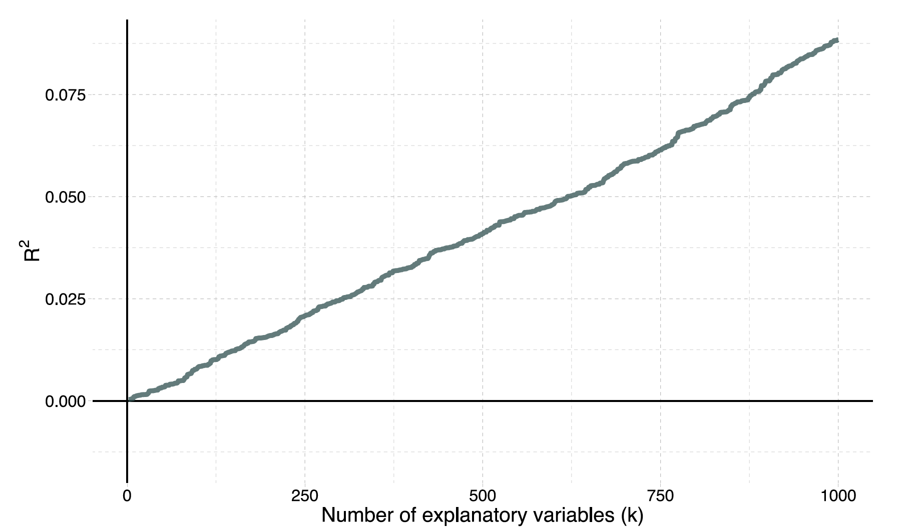
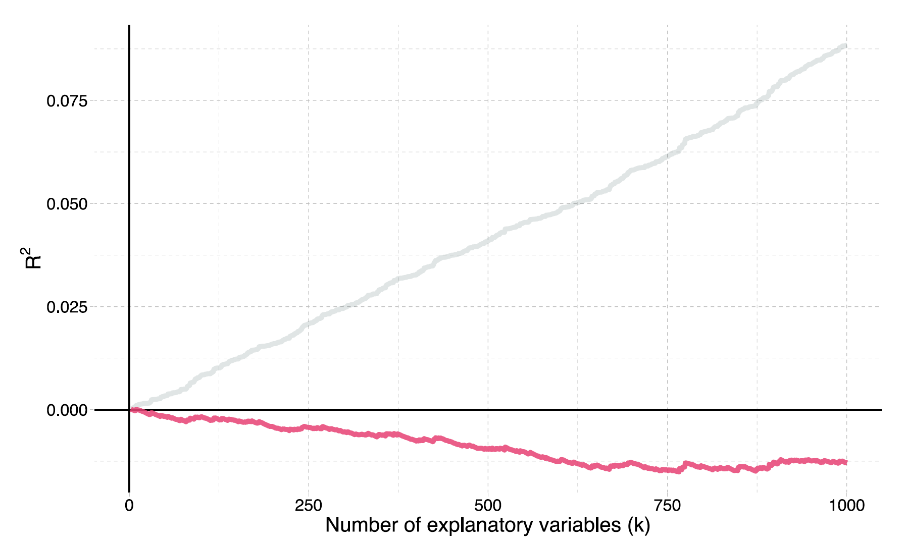
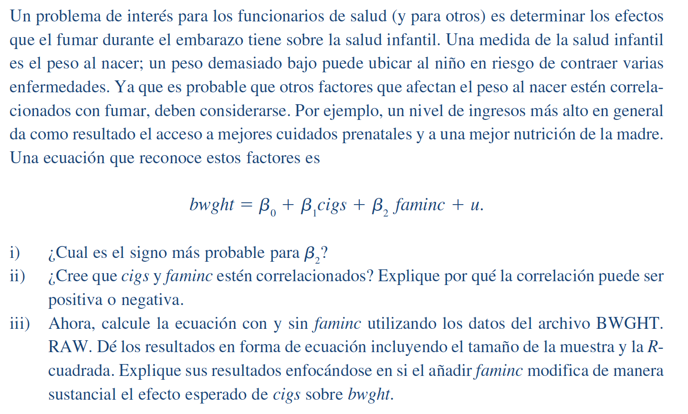
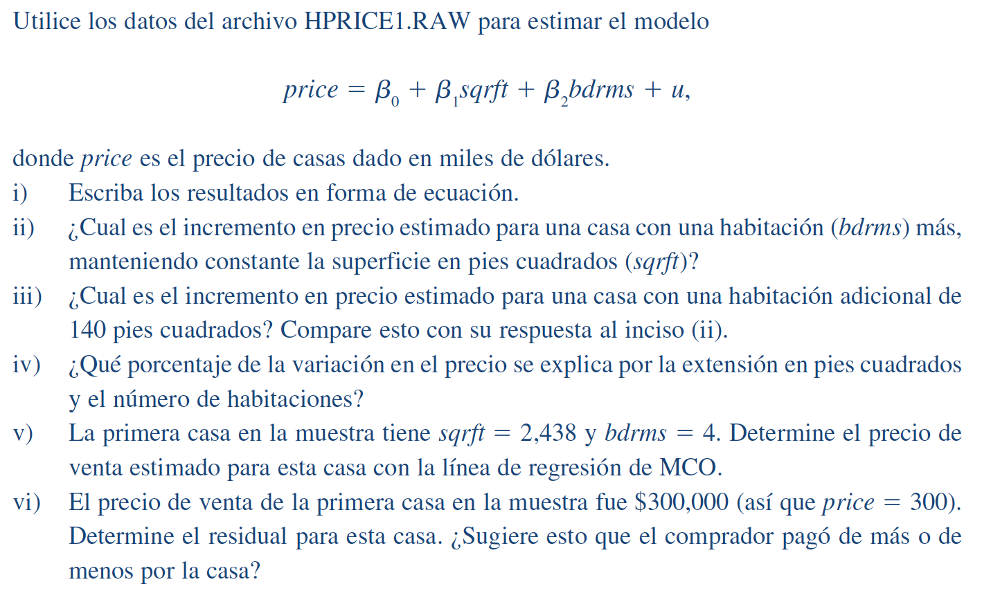
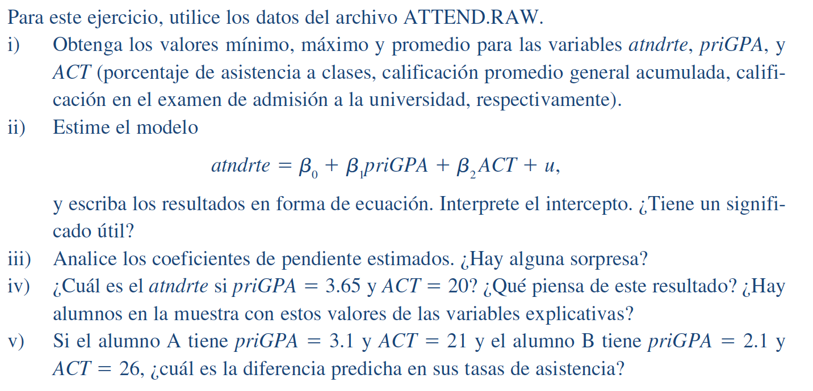
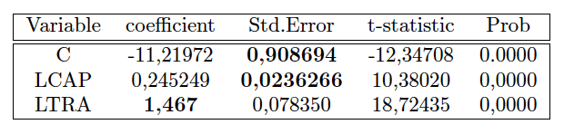

class: inverse, middle

```{r Setup, include = F}
options(htmltools.dir.version = FALSE)
library(pacman)
p_load(broom, latex2exp, ggplot2, ggthemes, ggforce, viridis, dplyr, 
       magrittr, knitr, tidyverse, parallel, faux, eulerr)

# Knitr options
opts_chunk$set(
  comment = ">",
  fig.align = "center",
  fig.height = 7,
  fig.width = 10.5,
  warning = F,
  message = F
)

# A blank theme for ggplot
theme_empty <- theme_bw() + theme(
  line = element_blank(),
  rect = element_blank(),
  strip.text = element_blank(),
  axis.text = element_blank(),
  plot.title = element_blank(),
  axis.title = element_blank(),
  plot.margin = structure(c(0, 0, -0.5, -1), unit = "lines", valid.unit = 3L, class = "unit"),
  legend.position = "none")

theme_simple <- theme_bw() + theme(
  line = element_blank(),
  panel.grid = element_blank(),
  rect = element_blank(),
  strip.text = element_blank(),
  axis.text.x = element_text(size = 14),
  axis.text.y = element_blank(),
  axis.ticks = element_blank(),
  plot.title = element_blank(),
  axis.title = element_blank(),
  legend.position = "none")

theme_axes <- theme_empty + theme(
  axis.title = element_text(size = 18),
  plot.margin = structure(c(0, 0, 0.1, 0), unit = "lines", valid.unit = 3L, class = "unit"))
```

```{R, colors, include = F}
# Define pink color
red_pink <- "#e64173"
turquoise <- "#20B2AA"
orange <- "#FFA500"
red <- "#fb6107"
blue <- "#2b59c3"
green <- "#8bb174"
grey_light <- "grey70"
grey_mid <- "grey50"
grey_dark <- "grey20"
purple <- "#6A5ACD"
```

```{R, gen dataset, include = F, cache = T}
# Set population and sample sizes
n_p <- 100
n_s <- 30
# Set the seed
set.seed(12468)
# Generate data
pop_df <- tibble(
  i = 3,
  x = rnorm(n_p, mean = 5, sd = 1.5),
  e = rnorm(n_p, mean = 0, sd = 1),
  y = i + 0.5 * x + e,
  row = rep(1:sqrt(n_p), times = sqrt(n_p)),
  col = rep(1:sqrt(n_p), each = sqrt(n_p)),
  s1 = sample(x = c(rep(T, n_s), rep(F, n_p - n_s))),
  s2 = sample(x = c(rep(T, n_s), rep(F, n_p - n_s))),
  s3 = sample(x = c(rep(T, n_s), rep(F, n_p - n_s)))
)
# Regressions
lm0 <- lm(y ~ x, data = pop_df)
lm1 <- lm(y ~ x, data = filter(pop_df, s1 == T))
lm2 <- lm(y ~ x, data = filter(pop_df, s2 == T))
lm3 <- lm(y ~ x, data = filter(pop_df, s3 == T))
# Simulation
set.seed(12468)
sim_df <- mclapply(mc.cores = 10, X = 1:1e4, FUN = function(x, size = n_s) {
  lm(y ~ x, data = pop_df %>% sample_n(size = size)) %>% tidy()
}) %>% do.call(rbind, .) %>% as_tibble()
```


# Regresión múltiple

---
layout: true
# Regresión múltiple

---

## Más variables explicativas


Pasamos de la **regresión lineal simple** (una .pink[variable de resultado] y una .purple[variable explicativa])

$$ \color{#e64173}{y_i} = \beta_0 + \beta_1 \color{#6A5ACD}{x_i} + u_i $$

a la tierra de la **regresión lineal múltiple** (un .pink[variable de resultado] y varios .purple[variables explicativas])

$$ \color{#e64173}{y\_i} = \beta\_0 + \beta\_1 \color{#6A5ACD}{x\_{1i}} + \beta\_2 \color{#6A5ACD}{x\_{2i}} + \cdots + \beta\_k \color{#6A5ACD}{x\_{ki}} + u\_i $$

--

**¿Por qué?**
--
 Podemos explicar mejor la variación en $y$, mejorar las predicciones, evitar el sesgo de variables omitidas, ...

---

```{R, gen data, cache = T, include = F}
n <- 1e2
set.seed(1989)
gen_df <- tibble(
  x1 = runif(n = n, min = -3, max = 3),
  x2 = sample(x = c(F, T), size = n, replace = T),
  u  = rnorm(n = n, mean = 0, sd = 1),
  y  = -0.5 + x1 + x2 * 4 + u
)
mean_a <- filter(gen_df, x2 == F)$y %>% mean()
mean_b <- filter(gen_df, x2 == T)$y %>% mean()
gen_df %<>% mutate(y_dm = y - mean_a * (x2 == F) - mean_b * (x2 == T))
```

$y_i = \beta_0 + \beta_1 x_{1i} + \beta_2 x_{2i} + u_i \quad$ $x_1$ es continua $\quad x_2$ es categórica

```{R, mult reg plot 1, dev = "svg", echo = F, fig.height = 6.25}
ggplot(data = gen_df, aes(y = y, x = x1, color = x2, shape = x2)) +
geom_hline(yintercept = 0) +
geom_vline(xintercept = 0) +
annotate("text", x = -0.075, y = 7.75, label = TeX("$y$"), size = 8) +
annotate("text", x = 2.95, y = 0.3, label = TeX("$x_1$"), size = 8) +
geom_point(size = 3) +
ylim(c(-4.5, 8)) +
theme_empty +
scale_color_manual(
  expression(x[2]),
  values = c("darkslategrey", red_pink),
  labels = c("A", "B")
) +
scale_shape_manual(
  expression(x[2]),
  values = c(1, 19),
  labels = c("A", "B")
) +
theme(
  legend.position = "bottom",
  text = element_text(size = 20)
)
```

---
count: false

La intercepción y la variable categórica $x_2$ controlan las medias de los grupos.

```{R, mult reg plot 2, dev = "svg", echo = F, fig.height = 6.25}
ggplot(data = gen_df, aes(y = y, x = x1, color = x2, shape = x2)) +
geom_hline(yintercept = mean_a, color = "darkslategrey", alpha = 0.5) +
geom_hline(yintercept = mean_b, color = red_pink, alpha = 0.5) +
geom_hline(yintercept = 0) +
geom_vline(xintercept = 0) +
annotate("text", x = -0.075, y = 7.75, label = TeX("$y$"), size = 8) +
annotate("text", x = 2.95, y = 0.3, label = TeX("$x_1$"), size = 8) +
geom_point(size = 3) +
ylim(c(-4.5, 8)) +
theme_empty +
scale_color_manual(
  expression(x[2]),
  values = c("darkslategrey", red_pink),
  labels = c("A", "B")
) +
scale_shape_manual(
  expression(x[2]),
  values = c(1, 19),
  labels = c("A", "B")
) +
theme(
  legend.position = "bottom",
  text = element_text(size = 20)
)
```

---
count: false

Con los medias de los grupos eliminados:

```{R, mult reg plot 3, dev = "svg", echo = F, fig.height = 6.25}
ggplot(data = gen_df %>% mutate(y = y - 4 * x2), aes(y = y_dm, x = x1)) +
geom_hline(yintercept = 0) +
geom_vline(xintercept = 0) +
annotate("text", x = -0.075, y = 7.75, label = TeX("$y$"), size = 8) +
annotate("text", x = 2.95, y = 0.3, label = TeX("$x_1$"), size = 8) +
geom_point(size = 3, aes(color = x2, shape = x2)) +
ylim(c(-4.5, 8)) +
theme_empty +
scale_color_manual(
  expression(x[2]),
  values = c("darkslategrey", red_pink),
  labels = c("A", "B")
) +
scale_shape_manual(
  expression(x[2]),
  values = c(1, 19),
  labels = c("A", "B")
) +
theme(
  legend.position = "bottom",
  text = element_text(size = 20)
)
```

---
count: false

$\hat{\beta}_1$ estima la relación la relación entre $y$ y $x_1$ después de controlar por $x_2$.

```{R, mult reg plot 4, dev = "svg", echo = F, fig.height = 6.25}
ggplot(data = gen_df %>% mutate(y = y - 4 * x2), aes(y = y_dm, x = x1)) +
geom_smooth(method = lm, se = F, color = "orange") +
geom_hline(yintercept = 0) +
geom_vline(xintercept = 0) +
annotate("text", x = -0.075, y = 7.75, label = TeX("$y$"), size = 8) +
annotate("text", x = 2.95, y = 0.3, label = TeX("$x_1$"), size = 8) +
geom_point(size = 3, aes(color = x2, shape = x2)) +
ylim(c(-4.5, 8)) +
theme_empty +
scale_color_manual(
  expression(x[2]),
  values = c("darkslategrey", red_pink),
  labels = c("A", "B")
) +
scale_shape_manual(
  expression(x[2]),
  values = c(1, 19),
  labels = c("A", "B")
) +
theme(
  legend.position = "bottom",
  text = element_text(size = 20)
)
```

---
count: false

Otra manera de pensar sobre esto:

```{R, mult reg plot 5, dev = "svg", echo = F, fig.height = 6.25}
ggplot(data = gen_df, aes(y = y, x = x1, color = x2, shape = x2)) +
geom_smooth(method = lm, se = F) +
geom_hline(yintercept = 0) +
geom_vline(xintercept = 0) +
annotate("text", x = -0.075, y = 7.75, label = TeX("$y$"), size = 8) +
annotate("text", x = 2.95, y = 0.3, label = TeX("$x_1$"), size = 8) +
geom_point(size = 3) +
ylim(c(-4.5, 8)) +
theme_empty +
scale_color_manual(
  expression(x[2]),
  values = c("darkslategrey", red_pink),
  labels = c("A", "B")
) +
scale_shape_manual(
  expression(x[2]),
  values = c(1, 19),
  labels = c("A", "B")
) +
theme(
  legend.position = "bottom",
  text = element_text(size = 20)
)
```

---
Mirar a nuestro estimador puede ayudar, también. 

Para una regresión simple $y_i = \beta_0 + \beta_1 x_i + u_i$

$$
\begin{aligned}
  \hat{\beta}_1 &= \\[0.3em]
  &= \dfrac{\sum_i \left( x_i - \overline{x} \right) \left( y_i - \overline{y} \right)}{\sum_i \left( x_i -\overline{x} \right)} \\[0.3em]
  &= \dfrac{\sum_i \left( x_i - \overline{x} \right) \left( y_i - \overline{y} \right)/(n-1)}{\sum_i \left( x_i -\overline{x} \right) / (n-1)} \\[0.3em]
  &= \dfrac{\mathop{\hat{\text{Cov}}}(x,\,y)}{\mathop{\hat{\text{Var}}} \left( x \right)}
\end{aligned}
$$

---
El estimador de regresión simple:

$$ \hat{\beta}_1 = \dfrac{\mathop{\hat{\text{Cov}}}(x,\,y)}{\mathop{\hat{\text{Var}}} \left( x \right)} $$

Pasando a la regresión lineal múltiple, el estimador cambia ligeramente:

$$ \hat{\beta}_1 = \dfrac{\mathop{\hat{\text{Cov}}}(\color{#e64173}{\tilde{x}_1},\,y)}{\mathop{\hat{\text{Var}}} \left( \color{#e64173}{\tilde{x}_1} \right)} $$

donde $\color{#e64173}{\tilde{x}_1}$ es la variable *residualizada* $x_1$, la variación restante en $x$ después de controlar las otras variables explicativas.

---
Más formalmente, considere el modelo de regresión múltiple

$$ y_i = \beta_0 + \beta_1 x_1 + \beta_2 x_2 + \beta_3 x_3 + u_i $$

Nuestro $x_{1}$ residualizado (que llamamos $\color{# e64173}{\tilde{x}_1}$) proviene de hacer una regresión de $x_1$ en una intersección y todas las demás variables explicativas y recopilar los residuos, _es decir_,

$$
\begin{aligned}
  \hat{x}_{1i} &= \hat{\gamma}_0 + \hat{\gamma}_2 \, x_{2i} + \hat{\gamma}_3 \, x_{3i} \\
  \color{#e64173}{\tilde{x}_{1i}} &= x_{1i} - \hat{x}_{1i}
\end{aligned}
$$

--

lo que nos permite comprender mejor nuestro estimador de regresión múltiple MCO 🤓

$$ \hat{\beta}_1 = \dfrac{\mathop{\hat{\text{Cov}}}(\color{#e64173}{\tilde{x}_1},\,y)}{\mathop{\hat{\text{Var}}} \left( \color{#e64173}{\tilde{x}_1} \right)} $$
---
layout: false
class: clear, middle

```{R, venn_iv, echo = F, dev = "svg"}
# Colors (order: x1, x2, x3, y)
venn_colors <- c(purple, red, "grey60", orange)
# Locations of circles
venn_df <- tibble(
  x  = c( 0.0,   -0.5,    1.5,   -1.0),
  y  = c( 0.0,   -2.5,   -1.8,    2.0),
  r  = c( 1.9,    1.5,    1.5,    1.3),
  l  = c( "Y", "X[1]", "X[2]", "X[3]"),
  xl = c( 0.0,   -0.5,    1.6,   -1.0),
  yl = c( 0.0,   -2.5,   -1.9,    2.2)
)
# Venn
ggplot(data = venn_df, aes(x0 = x, y0 = y, r = r, fill = l, color = l)) +
geom_circle(alpha = 0.3, size = 0.75) +
theme_void() +
theme(legend.position = "none") +
scale_fill_manual(values = venn_colors) +
scale_color_manual(values = venn_colors) +
geom_text(aes(x = xl, y = yl, label = l), size = 9, family = "Fira Sans Book", parse = T) +
annotate(
  x = -5.5, y = 3.3,
  geom = "text", label = "Regresión Múltiple", size = 9, family = "Fira Sans Book", hjust = 0
) +
xlim(-5.5, 4.5) +
ylim(-4.2, 3.4) +
coord_equal()
```

---
layout: true
# Regresión Múltiple

---
## Ajuste del modelo

Las medidas de *bondad de ajuste* intentan analizar qué tan bien nuestro modelo describe (*ajusta*) los datos.

**Medida común:** $R^2$ [R-cuadrado] (*a.k.a.* coeficiente de determinación)

$$ R^2 = \dfrac{\sum_i (\hat{y}_i - \overline{y})^2}{\sum_i \left( y_i - \overline{y} \right)^2} = 1 - \dfrac{\sum_i \left( y_i - \hat{y}_i \right)^2}{\sum_i \left( y_i - \overline{y} \right)^2} $$

Observe a nuestro viejo amigo SCR: $\sum_i \left( y_i - \hat{y}_i \right)^2 = \sum_i e_i^2$.

--

$R^2$ literalmente nos dice la parte de la varianza en $y$ que representan nuestros modelos actuales. Por lo tanto $0 \leq R^2 \leq 1$.

---

**El problema:** A medida que agregamos variables a nuestro modelo, el $R^2$ se incrementa *mecánicamente*.

--

Para ver este problema, podemos simular un conjunto de datos de 10.000 observaciones en $y$ y 1.000 variables aleatorias $x_k$. **¡No hay relaciones entre $y$ y $x_k$!**

Esquema de pseudocódigo de la simulación:
--

.pseudocode-small[

- Generamos 10.000 observaciones de $y$
- Generamos 10.000 observaciones sobre las variables $x_1$ hasta $x_{1000}$
- Regresiones
  - LM<sub>1</sub>: Regresamos $y$ en $x_1$; registro R<sup>2</sup>
  - LM<sub>2</sub>: Regresamos $y$ en $x_1$ y $x_2$; registro R<sup>2</sup>
  - LM<sub>3</sub>: Regresamos $y$ en $x_1$, $x_2$, y $x_3$; registro R<sup>2</sup>
  - ...
  - LM<sub>1000</sub>: Regresamos $y$ en $x_1$, $x_2$, ..., $x_{1000}$; registro R<sup>2</sup>
]

---

**El problema:** A medida que agregamos variables a nuestro modelo, el $R^2$ se incrementa *mecánicamente*.

Código de .mono[R] para la simulación:


```{R, r2 data code, eval = F, cache = T}
set.seed(1989)
y <- rnorm(1e4)
x <- matrix(data = rnorm(1e7), nrow = 1e4)
x %<>% cbind(matrix(data = 1, nrow = 1e4, ncol = 1), x)
r_df <- mclapply(X = 1:(1e3-1), mc.cores = 2, FUN = function(i) {
  tmp_reg <- lm(y ~ x[,1:(i+1)]) %>% summary()
  data.frame(
    k = i + 1,
    r2 = tmp_reg %$% r.squared,
    r2_adj = tmp_reg %$% adj.r.squared
  )
}) %>% bind_rows()
```

---

**El problema:** A medida que agregamos variables a nuestro modelo, el $\color{#314f4f}{R^2}$ se incrementa *mecánicamente*.

.center[
]

---

**Una solución:** $\color{#e64173}{R^2}$ .pink[Ajustado] 


.center[
]

---

**El problema:** A medida que agregamos variables a nuestro modelo, el $R^2$ se incrementa *mecánicamente*.

**Una solución:** Penalizar por el número de variables, _por ejemplo_, $R^2$ ajustado:

$$ \overline{R}^2 = 1 - \dfrac{\sum_i \left( y_i - \hat{y}_i \right)^2/(n-k-1)}{\sum_i \left( y_i - \overline{y} \right)^2/(n-1)} $$

*Nota:* El $R^2$ ajustado no necesita estar entre 0 y 1.

---
layout: false
class: inverse, middle
# Incertidumbre e inferencia

---
layout: true
# Incertidumbre e inferencia
## Aprendiendo de nuestros errores

---

Como señaló nuestra simulación anterior, nuestro problema con la **incertidumbre** es que no sabemos si nuestra estimación muestral está *cerca* o *lejos* del parámetro poblacional desconocido. <sup>.pink[†]</sup>

Sin embargo, no todo está perdido. Podemos usar los errores $\left (e_i = y_i - \hat {y}_i\right)$ para tener una idea de qué tan bien nuestro modelo explica la variación observada en $y$.

Cuando nuestro modelo parece estar haciendo un "buen" trabajo, es posible que tengamos un poco más de confianza al usarlo para conocer la relación entre $y$ y $x$.

Ahora solo tenemos que formalizar lo que realmente significa un "buen trabajo".

.footnote[.pink[†]: Excepto cuando corremos la simulación nosotros mismos, por eso nos gustan las simulaciones.]

---

En primer lugar, estimaremos la varianza de $u_i$ (recordemos: $\mathop{\text{Var}}\left(u_i \right) = \sigma^2$) usando nuestros errores al cuadrado, _es decir_,

$$ s^2 = \dfrac{\sum_i e_i^2}{n - k} $$

donde $k$ nos da el número de términos de constantes y variables que estimamos, _ejemplo_, $\ beta_0$ y $\beta_1$ darían $k = 2$.

$s^2$ es un estimador insesgado de $\sigma^2$.

---

Luego mostramos que la varianza de $\hat{\beta}_1$ (para una regresión lineal simple) es

$$ \mathop{\text{Var}} \left( \hat{\beta}_1 \right) = \dfrac{s^2}{\sum_i \left( x_i - \overline{x} \right)^2} $$

lo que muestra que la varianza de nuestro estimador de pendiente:

1. aumenta a medida que nuestras residuos se vuelven más ruidosas
2. disminuye a medida que aumenta la varianza de $x$


---


*Más comúnmente:* El **error estándar** de $\hat{\beta}_1$

$$ \mathop{\hat{\text{EE}}} \left( \hat{\beta}_1 \right) = \sqrt{\dfrac{s^2}{\sum_i \left( x_i - \overline{x} \right)^2}} $$

*Recuerden:* El error estándar de un estimador es la desviación estándar de la distribución del estimador.

---

El error estándar en .mono[R]'s `lm`, se ve así:

```{R, se}
tidy(lm(y ~ x, pop_df))
```


---

Usamos el error estándar de $\hat{\beta}_1$, junto con el propio $\hat{\beta}_1$, para aprender sobre el parámetro $\beta_1$.

Después de derivar la distribución de $\hat{\beta}_1$, <sup>.pink[†]</sup> tenemos dos opciones (relacionadas) para la inferencia estadística formal (aprendizaje) sobre nuestro parámetro desconocido $\beta_1$:

- **Intervalos de confianza:** Utilizar la estimación y su error estándar para crear un intervalo que, cuando se repite, generalmente <sup>.pink[††]</sup> contendrá el parámetro verdadero.

- **Pruebas de hipótesis:** Determinan si existe evidencia estadísticamente significativa para rechazar un valor o rango de valores hipotéticos.

.footnote[
.pink[†]: *Pista:* es normal con la media y la varianza que hemos derivado/discutido anteriormente)
<br>
.pink[††]: _Ejemplo_, los intervalos de confianza del 95% construidos de manera similar contendrán el parámetro verdadero el 95% del tiempo.
]


---
layout: true
# Incertidumbre e inferencia
## Intervalos de confianza

Construimos intervalos de confianza nivel $(1-\alpha)$ para $\beta_1$
$$ \hat{\beta}\_1 \pm t\_{\alpha/2,\text{gl}} \, \mathop{\hat{\text{EE}}} \left(\hat{\beta}\_1\right) $$

---

$t_{\alpha/2,\text{gl}}$ denota el $\alpha/2$ cuantial de una distribución $t$ con $n-k$ grados de libertad.

---

Por ejemplo, 100 obs., dos coeficientes (_es decir_, $\hat{\beta}_0$ y $\hat{\beta}_1 \ \text{implica} \ k = 2$) y $\alpha = 0.05$ (para un intervalo de confianza del 95%) nos da $t_ {0.025, \, 98} = `r qt(0.025, 98)%>% round (2)`$


```{R, t dist, echo = F, dev = "svg", fig.height = 3}
d6 <- tibble(x = seq(-4, 4, 0.01), y = dt(x, df = 98)) %>%
  rbind(., tibble(x = seq(4, -4, -0.01), y = 0))
ggplot() +
geom_polygon(data = d6, aes(x, y), fill = "grey85") +
geom_polygon(data = d6 %>% filter(x <= qt(0.025, 98)), aes(x, y), fill = red_pink) +
geom_hline(yintercept = 0, color = "black") +
geom_vline(xintercept = qt(0.025, 98), size = 0.35, linetype = "solid") +
theme_simple +
theme(axis.text.x = element_text(size = 12))
```

---

**Ejemplo:**
```{R ci r output, echo = T, highlight.output = 5}
lm(y ~ x, data = pop_df) %>% tidy()
```

--


Nuestro intervalo de confianza del 95% es $0.567\pm1.98\times0.0793= \left[0.410, \, 0.724 \right]$

---
layout: true
# Incertidumbre e inferencia
## Intervalos de confianza

---

Así que tenemos un intervalo de confianza para $\beta_1$, _i.e._, $\left[ 0.410,\, 0.724 \right]$.

Y... ¿qué significa?

--

**Informalmente:** El intervalo de confianza nos da una región (intervalo) en la que podemos depositar algo de confianza (confianza) para contener el parámetro.

-

**Más formalmente:** Si muestrea repetidamente de nuestra población y construye intervalos de confianza para cada una de estas muestras, $(1- \alpha)$ por ciento de nuestros intervalos (_ejemplo_, 95%) contendrá el parámetro de población *en algún lugar del intervalo*.

--

De nuevo a nuestra simulación...

---
Extrajimos 10.000 muestras (cada una de tamaño $n = 30$) de nuestra población y estimamos nuestro modelo de regresión para cada una de estas simulaciones:

$$ y_i = \hat {\beta}_0 + \hat{\beta}_1 x_i + e_i $$
<center> (repetido 10.000 veces) </center>

Ahora, estimemos intervalos de confianza del 95% para cada uno de estos intervalos...
---

```{R, simulation ci data, include = F}
# Create confidence intervals for b1
ci_df <- sim_df %>% filter(term == "x") %>%
  mutate(
    lb = estimate - std.error * qt(.975, 28),
    ub = estimate + std.error * qt(.975, 28),
    ci_contains = (lm0$coefficients[2] >= lb) & (lm0$coefficients[2] <= ub),
    ci_above = lm0$coefficients[2] < lb,
    ci_below = lm0$coefficients[2] > ub,
    ci_group = 2 * ci_above + (!ci_below)
  ) %>%
  arrange(ci_group, estimate) %>%
  mutate(x = 1:1e4)
```

**De nuestras simulaciones previas:** `r ci_df$ci_contains %>% multiply_by(100) %>% mean() %>% round(1)`% el 95% de los intervalos de confianza contienen el verdadero valor de parámetro de $\beta_1$.

```{R, simulation ci, echo = F, dev = "svg", fig.height = 5.5}
# Plot
ggplot(data = ci_df) +
geom_segment(aes(y = lb, yend = ub, x = x, xend = x, color = ci_contains)) +
geom_hline(yintercept = lm0$coefficients[2]) +
scale_y_continuous(breaks = lm0$coefficients[2], labels = TeX("$\\beta_1$")) +
scale_color_manual(values = c(red_pink, "grey85")) +
theme_simple +
theme(
  axis.text.x = element_blank(),
  axis.text.y = element_text(size = 18)
)
```

---
layout: true
# Incertidumbre e inferencia
## Testeo de hipotesis

---

En muchas aplicaciones, queremos saber más que una estimación puntual o un rango de valores. Queremos saber qué dice nuestra evidencia estadística sobre las teorías existentes.

Queremos probar hipótesis planteadas por funcionarios, políticos, economistas, científicos, amigos, vecinos raros, *etcétera*.

.hi-slate[Ejemplos]

- ¿El aumento de la presencia policial **reduce la delincuencia**?
- ¿Construir un muro gigante **reduce el crimen**?
- ¿El cierre de un gobierno **afecta negativamente a la economía**?
- ¿El cannabis legal **reduce la conducción en estado de ebriedad** o **reduce el uso de opiáceos**?
- ¿Los estándares de calidad del aire **aumentan la salud** y/o **reducen el empleo**?

---

La prueba de hipótesis se basa en resultados e intuición muy similares.

Si bien la incertidumbre ciertamente existe, aún podemos construir pruebas estadísticas *confiables* (rechazando o no rechazando una hipótesis planteada).

--

.hi-slate[MCO prueba *t*] Nuestra hipótesis (nula) establece que $\beta_1$ es igual a un valor $c$, _por ejemplo_, $\left.H_{0} \ \right) \beta_{1}=0$

Bajo los supuestos del modelo lineal clásico (MLC),

$$ t_\text{estadístico} = \dfrac{\hat{\beta}_1 - c}{\mathop{\hat{\text{EE}}} \left( \hat{\beta}_1 \right)} $$

sigue una distribución $t$ con $n-k$ grados de libertad.

---

Para una prueba **de dos caras** de nivel $\alpha $, rechazamos la hipótesis nula (y concluimos con la hipótesis alternativa) cuando

$$ \left|t\_\text{estadístico}\right| > \left|t\_{1-\alpha/2,\,df}\right| $$
lo que significa que nuestra **estadística de prueba es más extrema que el valor crítico**.

Alternativamente, podemos calcular el **valor p** que acompaña a nuestra estadística de prueba, que efectivamente nos da la probabilidad de ver nuestra estadística de prueba *o una estadística de prueba más extrema* si la hipótesis nula fuera cierta.

Valores p muy pequeños (generalmente < 0.05) significan que sería improbable ver nuestros resultados si la hipotesis nula fuera realmente cierta; tendemos a rechazar el valor nulo para valores p por debajo de 0.05.

---

.mono[R] y .mono[Stata] testean por defecto contra el valor cero.

```{R hypothesis test, echo = T, highlight.output = 5}
lm(y ~ x, data = pop_df) %>% tidy()
```
--

$\left.H_{0} \ \right)\ \beta_1 = 0$ *vs.* $\left.H_{1} \ \right)\ \beta_1 \neq 0$

¿Qué observamos del valor-p?

El valor-*p* $< 0.05$. 

--

 $t_\text{stat} = 7.15$ y $t_\text{0.975, 28} = `r qt(0.975, 28) %>% round(2)`$
--
 lo que implica que el valor-*p* $< 0.05$. 

--

Entonces, .hi[rechazamos H.sub[0]].

---

¡De vuelta a nuestra simulación! Veamos qué está haciendo realmente nuestra estadística de $t$.

En esta situación, podemos conocer (y hacer cumplir) la hipótesis nula, ya que generamos los datos.

Para cada una de las 10.000 muestras, calcularemos la estadística $t$, y luego podremos ver cuántas estadísticas de $t$ exceden nuestro valor crítico (`r qt(0.975, 28) %>% round (2)`, como encima).

La respuesta debería ser aproximadamente el 5 por ciento, nuestro nivel $\alpha$.

---
layout: true
# Incertidumbre e inferencia

---

```{R, simulation t data, include = F}
# Calculate test statistics
t_df <- sim_df %>%
  filter(term == "x") %>%
  mutate(
    t_stat = (estimate - lm0$coefficients[2]) / std.error,
    reject = abs(t_stat) > abs(qt(0.975, 28))
  )
t_density <- density(t_df$t_stat, from = -5, to = 4) %$%
  data.frame(x = x, y = y) %>%
  mutate(area = abs(x) > abs(qt(0.975, 28)))
```

En nuestra simulación, el porcentaje `r t_df$reject %>% mean() %>% multiply_by(100) %>% round(1)` de nuestras estadísticas de $t$ rechaza la hipótesis nula.

La distribución de nuestras estadísticas de $t$ (sombreando las regiones de rechazo).

```{R, simulation t plot, echo = F, dev = "svg", fig.height = 5.75}
ggplot(data = t_density, aes(x = x, ymin = 0, ymax = y)) +
geom_vline(xintercept = 0) +
geom_ribbon(fill = "grey85", alpha = 0.8) +
geom_ribbon(
  data = t_density %>% filter(x < qt(0.025, 28)),
  fill = red_pink
) +
geom_ribbon(
  data = t_density %>% filter(x > qt(0.975, 28)),
  fill = red_pink
) +
geom_hline(yintercept = 0) +
# geom_vline(xintercept = qt(c(0.025, 0.975), df = 28), color = red_pink) +
theme_simple
```

---

```{R, simulation p data, include = F}
# Calculate test statistics
p_df <- sim_df %>%
  filter(term == "x") %>%
  mutate(
    p_value = 2 * pt(
      q = abs((estimate - lm0$coefficients[2]) / std.error),
      df = 28,
      lower.tail = F
    ),
    reject = p_value < 0.05
  )
p_density <- density(p_df$p_value, from = 0, to = 1) %$%
  data.frame(x = x, y = y) %>%
  mutate(area = x < 0.05)
```

En consecuencia, `r p_df$reject %>% mean() %>% multiply_by(100) %>% round(1)` % de nuestros p-valores rechazan la hipótesis nula.

La distribución de nuestros valores p (sombreando los valores p por debajo de 0,05).
```{R, simulation p plot, echo = F, dev = "svg", fig.height = 5.75}
ggplot(data = p_density, aes(x = x, ymin = 0, ymax = y)) +
geom_vline(xintercept = 0) +
geom_ribbon(fill = "grey85", alpha = 0.8) +
geom_ribbon(
  data = p_density %>% filter(x < 0.05),
  fill = red_pink
) +
geom_hline(yintercept = 0) +
theme_simple
```

---
layout: false
class: inverse, middle
# Aplicaciones en .mono[R]

---
#Ejercicio C3.1 (Wooldridge)

.center[
]
---
#Ejercicio C3.2 (Wooldridge)

.center[
]
---
#Ejercicio C3.4 (Wooldridge)

.center[
]

---
Se dispone de una muestra de 30 observaciones de datos que 	representan salario y experiencia laboral de economistas de Montevideo en 2013 y 2014. Las variables son: $y$ = salario (en miles USD); $x$ = experiencia posterior a recibirse (años).

Se tiene el siguiente modelo:

$$\mathrm{y}_{\mathrm{i}}=\beta_{1}+\beta_{2} \mathrm{x}_{\mathrm{i}}+\varepsilon_{\mathrm{i}}$$
Se sabe que:

$$\sum_{i=1}^{30} y_{i}^{2}=65692,27 \ ; \sum_{i=1}^{30} y_{i}=1365,1 \ ; \sum_{i=1}^{30} y_{i} x_{i}=26046,9$$
$$\sum_{i=1}^{30} x_{i}^{2}=12230 \ ; \ \sum_{i=1}^{30} x_{i}=550$$
$$\mathrm{SCR}=3089,95 \ ; \mathrm{SCT}=3574,67$$

---
1.1	Estime por mínimos cuadrados ordinarios los parámetros de dicho modelo.

1.2	Calcule la matriz de varianzas y covarianzas de los coeficientes estimados.

1.3	Interprete los resultados obtenidos y analice su significancia estadística.

1.4	Calcular el R2 del modelo. ¿Qué puede decir al respecto?

1.5	¿Qué relación debería encontrarse entre el vector de residuos y las variables explicativas?


---

.center[
]
