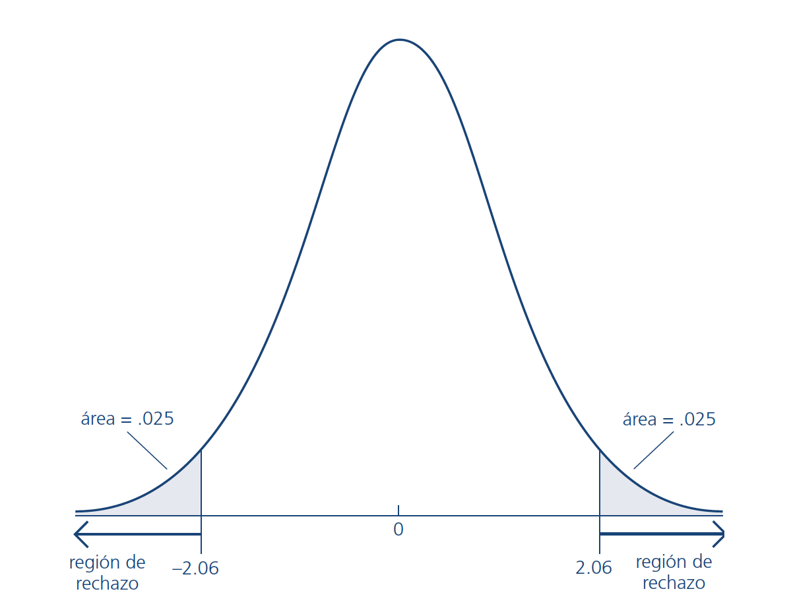
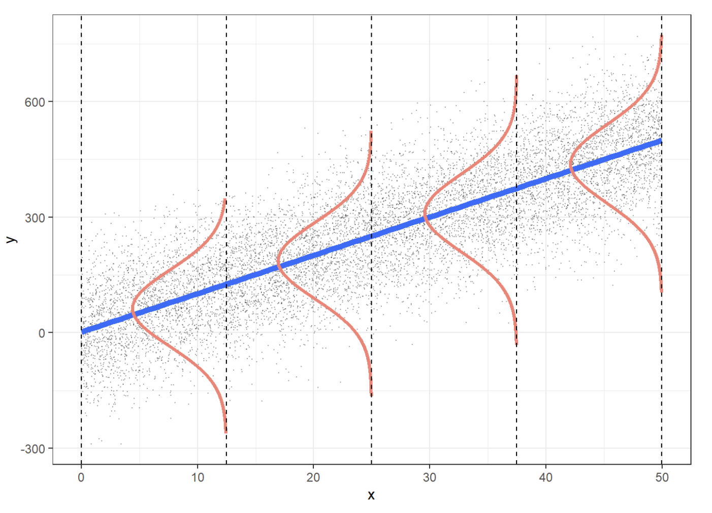

class: inverse, middle

```{r Setup, include = F}
options(htmltools.dir.version = FALSE)
library(pacman)
p_load(broom, latex2exp, ggplot2, ggthemes, ggforce, viridis, dplyr, 
       magrittr, knitr, tidyverse, parallel, faux, eulerr)

# Knitr options
opts_chunk$set(
  comment = ">",
  fig.align = "center",
  fig.height = 7,
  fig.width = 10.5,
  warning = F,
  message = F
)

# A blank theme for ggplot
theme_empty <- theme_bw() + theme(
  line = element_blank(),
  rect = element_blank(),
  strip.text = element_blank(),
  axis.text = element_blank(),
  plot.title = element_blank(),
  axis.title = element_blank(),
  plot.margin = structure(c(0, 0, -0.5, -1), unit = "lines", valid.unit = 3L, class = "unit"),
  legend.position = "none")

theme_simple <- theme_bw() + theme(
  line = element_blank(),
  panel.grid = element_blank(),
  rect = element_blank(),
  strip.text = element_blank(),
  axis.text.x = element_text(size = 14),
  axis.text.y = element_blank(),
  axis.ticks = element_blank(),
  plot.title = element_blank(),
  axis.title = element_blank(),
  legend.position = "none")

theme_axes <- theme_empty + theme(
  axis.title = element_text(size = 18),
  plot.margin = structure(c(0, 0, 0.1, 0), unit = "lines", valid.unit = 3L, class = "unit"))
```

```{R, colors, include = F}
# Define pink color
red_pink <- "#e64173"
turquoise <- "#20B2AA"
orange <- "#FFA500"
red <- "#fb6107"
blue <- "#2b59c3"
green <- "#8bb174"
grey_light <- "grey70"
grey_mid <- "grey50"
grey_dark <- "grey20"
purple <- "#6A5ACD"
```

# Bondad de ajuste

---
layout: true
# Bondad de ajuste

---

## Estadístico t - ¡de nuevo!

El modelo poblacional lo escribimos de la siguiente manera:

$$y=\beta_{0}+\beta_{1} x_{1}+\ldots+\beta_{k} x_{k}+\mu$$

.hi-purple[Distribución t para estimadores estandarizados:]

Bajo los supuestos del modelo lineal clásico (MLC),

$$\left(\hat{\beta}_{j}-\beta_{j}\right) / \operatorname{ee}\left(\hat{\beta}_{j}\right) \sim t_{n-k-1}$$
donde $k+1$ es la cantidad de parámetros desconocidos en el modelo poblacional $y=\beta_{0}+\beta_{1} x_{1}+\ldots+\beta_{k} x_{k}+\mu$, o sea $k$ parámetros de pendiente y el intercepto $\beta_{0}$.

- Testeo: $\left.H_{0} \ \right) \beta_{j}=0$
- Ejemplo: $\text{salario}_i = \beta_0 + \beta_1 \, \text{educación}_i + \beta_2 \, \text{experiencia}_i + \beta_3 \, \text{antigüedad}_i + \mu_i$
- ¿Qué significa testear: $\left.H_{0} \ \right) \beta_{j}=0$ en este caso?

---

## Estadístico de prueba $t$

$$t_{\hat{\beta}_{j}}=\frac{\hat{\beta}_{j}}{\operatorname{ee}\left(\hat{\beta}_{j}\right)}$$

.pull-left[

- A dos colas la regla de rechazo es $\left|t_{\hat{\beta}_{j}}\right|>c$
- Para encontrar $c$, definir $\alpha$, en general 5%
- Suponiendo que $N-k-1 = 25$]

.pull-right[
]

---
## Valor-p para el estadístico $t$

Alternativamente, podemos calcular el ** valor p ** que acompaña a nuestro estadístico de prueba, que efectivamente nos da la probabilidad de ver nuestro estadístico de prueba *o nuestro estadístico de prueba más extrema* si la hipótesis nula fuera cierta.

Valores $p$ muy pequeños, generalmente $<0.05$, significan que sería poco probable que veamos nuestros resultados si la hipótesis nula fuera realmente cierta; tendemos a rechazar el valor nulo para valores $p$ por debajo de $0.05$.
---

## Valor-p para el estadístico $t$

- Quitar arbitriariedad del nivel de significación elegido 

- El valor $p$ es la probabilidad de obtener valores de la prueba estadística que sean mayores o iguales (o más extremos) que el efectivamente observado si $\left.H_{0} \ \right)$ es cierto

- No rechazar $\left.H_{0} \ \right)$ si $p > \alpha$. En otro caso rechazar. Cuanto más chico es el $p$ más fuerte es el rechazo.

- Recordar que, en principio, queremos rechazar $\left.H_{0} \ \right)$ pues esto implica decir que hay evidencia para decir que $\beta_j$ es significativamente diferente de cero.

---

## Estadístico F

- El estadístico F se utiliza para contrastar hipótesis conjuntas sobre los coeficientes de regresión. 

- Las fórmulas para el estadístico F están integradas en los paquetes informáticos. 

- .hi.pink[Caso de dos restricciones:]

Cuando la hipótesis nula conjunta tiene las dos restricciones
de que $\beta_1 = 0$ y $\beta_2 =0$, el estadístico F combina los dos estadísticos $t$, $t_1$ y $t_2$, mediante la fórmula:


$$F=\frac{1}{2}\left(\frac{\left.t_{1}^{2}+t_{2}^{2}-2 \hat{\rho}_{t_{1}, t_{2}} t_{1} t_{2}\right)}{1-\hat{\rho}_{t_{1}, t_{2}}^{2}}\right)$$
donde $\hat{\rho}_{t_{1}, t_{2}}$ es un estimador de la correlación entre los dos estadísticos $t$.

---

## Estadístico F

- .hi.pink[Caso general de q restricciones:]

Bajo la hipótesis nula, el estadístico F tiene una distribución muestral que, en muestras grandes, está dada por la distribución $F_{q,\infty}$. Es decir, en muestras grandes, bajo la hipótesis nula el estadístico F se distribuye $F_{q,\infty}$.

---
layout: false
class: inverse, middle
# Aplicaciones en .mono[R]
---
class: inverse, middle

# Levantamiento de supuestos
---

# Recordemos los supuestos...


.pink[Supuesto 1.] Linealidad en parámetros. 
$$y=\beta_{0}+\beta_{1} x_{1}+\cdots+\beta_{k} x_{k}+u$$ 

.pink[Supuesto 2.] Muestra aleatoria. 
$$\left\{\left(y_{i}, x_{i}\right): i=1, \ldots, n\right\}$$ son variables aleatorias i.i.d.

.pink[Supuesto 3.] Exogeneidad estricta. 
$$E\left(u \mid x_{1}, \ldots, x_{k}\right)=0$$

.pink[Supuesto 4.] No multicolinealidad. En la muestra, ninguna de las variables independientes es constante y no hay relaciones lineales exactas entre las variables independientes.

---

# Recordemos los supuestos...

.pink[Supuesto 5.] Homocedasticidad y ausencia de autocorrelación.
$\operatorname{Var}\left(u \mid x_{1}, \ldots, x_{k}\right)=\sigma^{2}$ (homocedasticidad) y $\operatorname{COV}\left(u_{i}, u_{j} \mid x_{1}, \ldots, x_{k}\right)=0$

.pink[Supuesto 6.] Normalidad. 
$$u\left|x \sim \mathcal{N}\left(0, \sigma^{2}\right)\right|$$
.center[
]


---
#Omisión de variable relevante

.center[

] 
---
#Omisión de variable relevante

.hi-pink[Sesgo de variable omitida] Si el regresor está correlacionado con una variable que ha sido omitida en el análisis y ésta determina, en parte, la variable dependiente, el estimador MCO presentará sesgo de variable omitida.

El sesgo de variable omitida se produce cuando se cumplen dos condiciones: 

(1) cuando la variable omitida está correlacionada con los regresores incluidos en la regresión y 

(2) cuando la variable omitida es un factor determinante de la variable dependiente. 

.purple[Ejemplos:]

- Ejemplo #1: Porcentaje de estudiantes de inglés.

- Ejemplo #2: La hora del día de la prueba.

- Ejemplo #3: Espacio de aparcamiento por alumno.

---
#Omisión de variable relevante 

El sesgo de variable omitida significa que el tercer supuesto de mínimos cuadrados, que $E\left(u \mid x_{1}, \ldots, x_{k}\right)=0$, no se cumple. 

## ¿Por qué se incumple el supuesto 3?

Recordemos el término de error $u_i$ en el modelo de regresión lineal con un único regresor representa todos los factores, distintos de $X_i$, que son determinantes de $Y_i$. 

- Si uno de esos otros factores está correlacionado con $X_i$, esto significa que el término de error (que contiene a este factor) está correlacionado con $X_i$. En otras palabras, si una variable omitida es un determinante de $Y_i$, entonces está en el término de error, y si está correlacionada con $X_i$, entonces el término de error está correlacionado con $X_i$. 

---
# Omisión de variable relevante 

## ¿Por qué se incumple el supuesto 3?

- Debido a que $u_i$ y $X_i$ están correlacionados, la media condicional de $u_i$ dado $X_i$ es distinta de cero. Esta correlación por lo tanto, viola el tercer supuesto de mínimos cuadrados, y la consecuencia es grave: el estimador MCO es sesgado. Este sesgo no desaparece incluso en muestras muy grandes, y el estimador MCO es inconsistente.